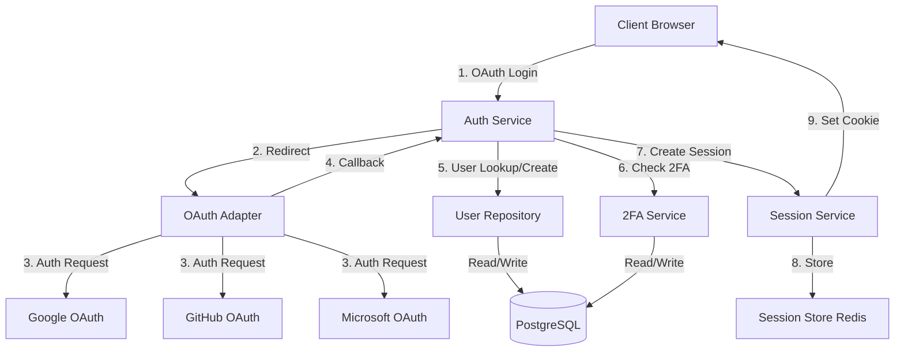
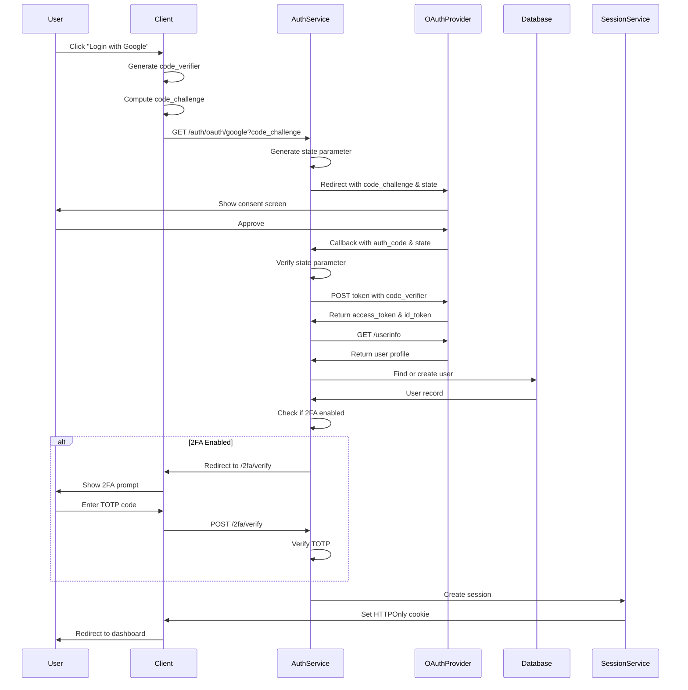
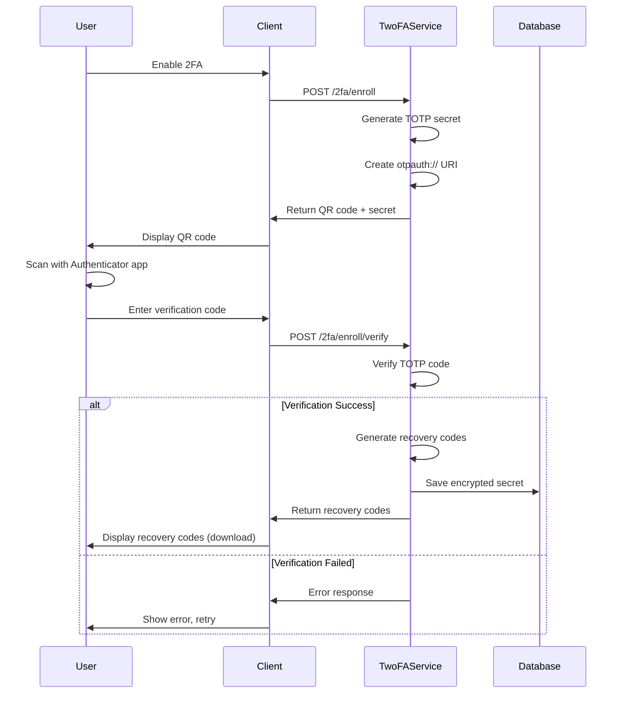
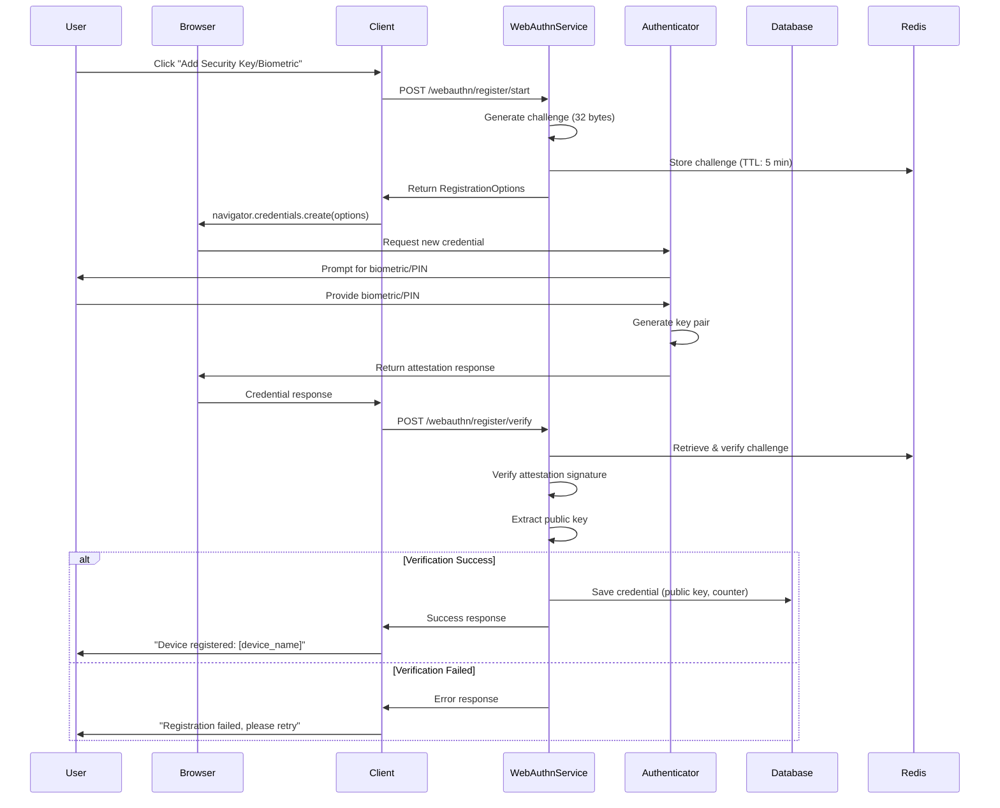
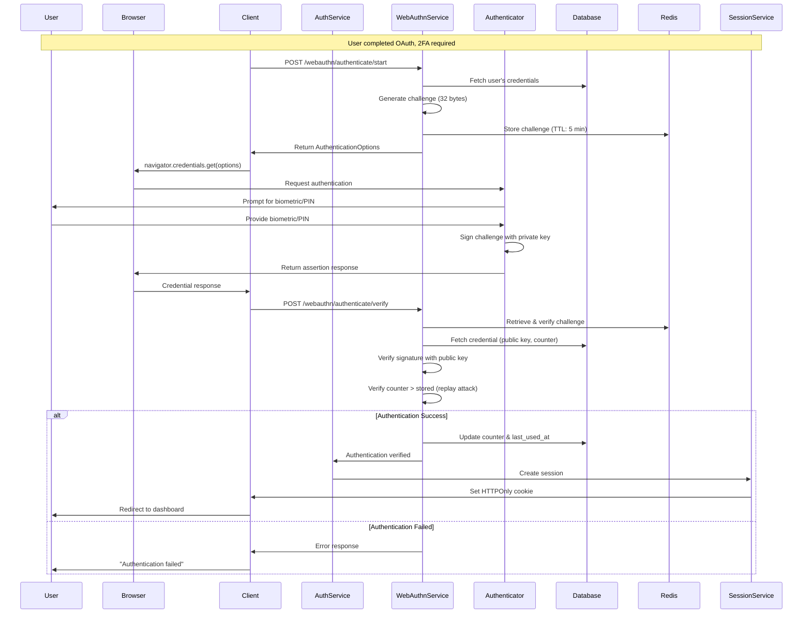
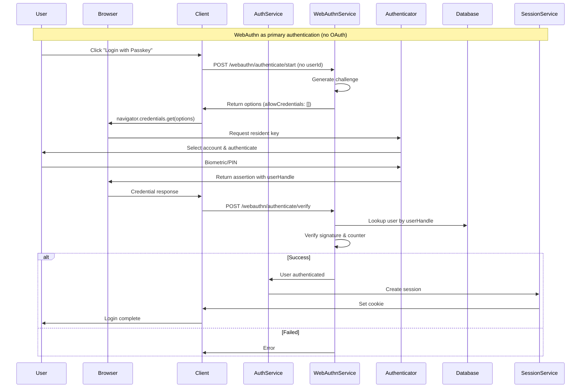
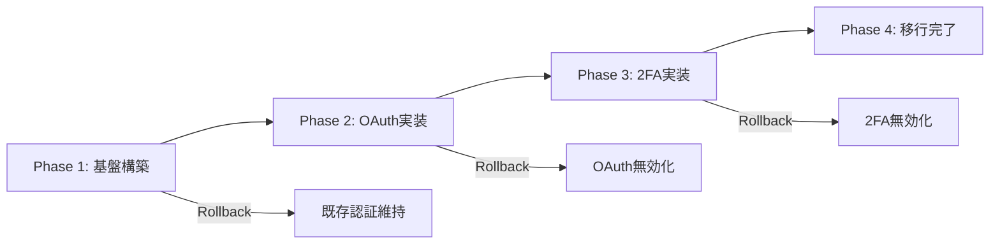

# 技術設計書: ユーザー認証システム（OAuth 2.0 + 2FA）

## Overview

**Purpose**: 本機能は、セキュアで使いやすいユーザー認証システムを提供し、OAuth 2.0による外部プロバイダー認証とTOTPベースの2要素認証を組み合わせることで、ユーザーアカウントの安全性を最大化します。

**Users**: エンドユーザーは外部アカウント（Google、GitHub、Microsoft）を使用して簡単にログインでき、追加のセキュリティが必要な場合は2FAを有効化できます。システム管理者はセキュリティイベントをモニタリングし、不正アクセスを検知できます。

**Impact**: 既存の認証メカニズムを完全に置き換え、最新のセキュリティ標準（RFC 9700、OWASP推奨事項）に準拠した認証基盤を構築します。

### Goals
- OAuth 2.0 Authorization Code Flow + PKCEによる安全な外部プロバイダー認証
- TOTPベースの2要素認証による多層防御
- HTTPOnly/Secure Cookieを使用した堅牢なセッション管理
- 包括的な監査ログとセキュリティイベント追跡

### Non-Goals
- パスワードベースの認証機能（OAuth専用）
- 生体認証（指紋、顔認証）のサポート
- マルチテナント機能（将来の拡張として検討）
- モバイルアプリ専用の認証フロー（Webベースのみ）

## Architecture

### High-Level Architecture



**Architecture Integration**:
- **Existing patterns preserved**: Expressミドルウェアパターン、Repository Pattern、Dependency Injection
- **New components rationale**:
  - Auth Service: 認証フローの集約、セキュリティポリシーの適用
  - OAuth Adapter: プロバイダー固有の処理を抽象化、拡張性の確保
  - 2FA Service: TOTP生成/検証のカプセル化、リカバリーコード管理
  - Session Service: セッションライフサイクル管理、Redis統合
- **Technology alignment**: TypeScript strict mode、PostgreSQL、Redis、Express
- **Steering compliance**: Clean Architecture原則、型安全性、単一責任の原則

### Technology Stack and Design Decisions

#### Backend
- **Language**: TypeScript 5.x (strict mode enabled)
  - **Rationale**: 型安全性、開発時エラー検出、IDEサポート
  - **Alternatives considered**: JavaScript（型安全性の欠如）、Go（学習コスト高）

- **Framework**: Express.js 4.x
  - **Rationale**: 既存システムとの整合性、豊富なミドルウェアエコシステム
  - **Alternatives considered**: Fastify（既存コードベースとの互換性）、NestJS（過度な複雑性）

- **OAuth Library**: Passport.js with OAuth strategies
  - **Rationale**: 実績のあるライブラリ、複数プロバイダーのサポート、PKCE対応
  - **Alternatives considered**: 自前実装（メンテナンスコスト高）、Auth0 SDK（ベンダーロックイン）

- **2FA Library**: otpauth
  - **Rationale**: 軽量、RFC 6238完全準拠、アクティブメンテナンス（63k週間DL）
  - **Alternatives considered**: speakeasy（7年間更新なし）、2fa（機能不足）

#### Data Storage
- **Primary Database**: PostgreSQL 14+
  - **Rationale**: ACID保証、複雑なクエリのサポート、既存インフラとの整合性
  - **Alternatives considered**: MongoDB（トランザクション制約）、MySQL（JSON型のサポート不足）

- **Session Store**: Redis 7.x
  - **Rationale**: 高速アクセス、TTLサポート、セッション管理に最適
  - **Alternatives considered**: In-memory（スケーラビリティ欠如）、PostgreSQL（パフォーマンス）

#### Key Design Decisions

**Decision 1: OAuth 2.0 Authorization Code Flow + PKCE**
- **Context**: RFC 9700（2025年1月公開）により、PKCEがすべてのOAuthクライアントで推奨されるセキュリティベストプラクティスとなった
- **Alternatives**:
  - Implicit Grant（非推奨、トークン漏洩リスク）
  - Client Credentials（ユーザーコンテキストなし）
  - PKCE なしのAuth Code Flow（CSRF/インターセプション脆弱性）
- **Selected Approach**: Authorization Code Flow + PKCE
  - Code Verifier（ランダム文字列43-128文字）をクライアントで生成
  - Code Challenge（SHA-256ハッシュ）を認証リクエストに含める
  - トークン交換時にCode Verifierを検証
- **Rationale**:
  - Authorization Code Interception攻撃からの保護
  - CSRF攻撃に対する防御（state パラメータと併用）
  - OAuth 2.1での必須化に先行対応
- **Trade-offs**:
  - Gain: 高度なセキュリティ、標準準拠、将来対応
  - Sacrifice: 実装の複雑性若干増加、古いクライアントとの互換性検討

**Decision 2: HTTPOnly/Secure Cookie + Refresh Token Pattern**
- **Context**: XSS攻撃によるトークン盗難を防ぎつつ、ユーザー体験を維持する必要がある
- **Alternatives**:
  - localStorage（XSS脆弱性、推奨されない）
  - sessionStorage（タブ間共有不可、UX問題）
  - メモリのみ（リフレッシュ時にログアウト）
- **Selected Approach**:
  - Access Token（短期、5-15分）はメモリに保持（Reactコンテキスト等）
  - Refresh Token（長期、7-30日）はHTTPOnly/Secure Cookieで保存
  - SameSite=Lax属性でCSRF防御を追加
- **Rationale**:
  - HTTPOnlyによりJavaScriptからのアクセス不可（XSS防御）
  - SecureフラグでHTTPS通信時のみ送信
  - SameSiteでCSRF攻撃を防御
  - 短期Access TokenでトークンリークのWindow最小化
- **Trade-offs**:
  - Gain: XSS/CSRF双方への堅牢な防御、セキュリティベストプラクティス準拠
  - Sacrifice: CORS設定の慎重な管理が必要、Cookieストレージの制限（4KB）

**Decision 3: TOTP over SMS-based 2FA**
- **Context**: 2要素認証の実装方法として、TOTP（Time-based One-Time Password）とSMS OTPが候補
- **Alternatives**:
  - SMS OTP（SIMスワッピング攻撃、通信コスト、遅延）
  - Email OTP（メールアカウント侵害リスク、遅延）
  - Hardware Token（コスト高、ユーザー負担大）
- **Selected Approach**: TOTP（RFC 6238準拠）
  - 共有秘密鍵をサーバーとAuthenticatorアプリで保持
  - 30秒ウィンドウで6桁コード生成
  - 時刻同期によるコード検証（±1ウィンドウ許容）
  - リカバリーコード（8個、10桁英数字）を併用
- **Rationale**:
  - SIMスワッピング攻撃に対する耐性
  - オフライン動作可能（ネットワーク不要）
  - コストゼロ（SMS送信料不要）
  - OWASP推奨のMFA方式
- **Trade-offs**:
  - Gain: 高セキュリティ、低コスト、高可用性
  - Sacrifice: ユーザーがAuthenticatorアプリのインストールが必要、時刻同期の依存

## System Flows

### OAuth Authentication Flow



### 2FA Enrollment Flow



### WebAuthn Registration Flow



### WebAuthn Authentication Flow



### Passwordless Authentication Flow (Future Enhancement)



## Requirements Traceability

| Requirement | Components | Interfaces | Flows |
|-------------|-----------|------------|-------|
| 1.1 OAuth Login Button | AuthService, OAuthAdapter | `POST /auth/oauth/{provider}` | OAuth Authentication Flow |
| 1.2 Token Exchange | OAuthAdapter | `exchangeAuthCode()` | OAuth Authentication Flow |
| 1.3 Auto User Creation | UserRepository | `findOrCreateByOAuth()` | OAuth Authentication Flow |
| 1.4 Token Refresh | OAuthAdapter | `refreshAccessToken()` | Token Refresh Flow |
| 1.5 CSRF Protection | AuthService | State parameter validation | OAuth Authentication Flow |
| 2.1 2FA Setup | TwoFAService | `POST /2fa/enroll` | 2FA Enrollment Flow |
| 2.2 TOTP Verification | TwoFAService | `verifyTOTP()` | 2FA Enrollment/Login Flow |
| 2.3 2FA After OAuth | AuthService | `requireTwoFactor()` | OAuth Authentication Flow |
| 2.4 Failed Attempts | TwoFAService, LockoutService | `trackFailedAttempt()` | 2FA Login Flow |
| 2.5 Recovery Codes | TwoFAService | `generateRecoveryCodes()` | 2FA Enrollment Flow |
| 3.1 Secure Cookies | SessionService | `createSession()` | All authentication flows |
| 3.2 Session Validation | SessionMiddleware | `validateSession()` | Every authenticated request |
| 3.3 Multi-device | SessionService | `listUserSessions()` | Session management |
| 3.4 Logout | SessionService | `destroySession()` | Logout flow |
| 3.5 HTTPS Only | Infrastructure | Nginx/Load Balancer config | All flows |
| 4.1 Error Logging | AuthService, Logger | `logAuthEvent()` | All flows |
| 4.2 Failed Attempt Log | SecurityLogger | `logFailedAuth()` | 2FA/OAuth flows |
| 4.3 Real-time Alerts | AlertService | `sendSecurityAlert()` | Authentication flows |
| 4.4 Audit Log | AuditLogger | `logAuditEvent()` | All flows |
| 5.1 Multi-provider | OAuthAdapter | Strategy pattern | OAuth flow |
| 5.2 Plugin Design | OAuthAdapter | `registerStrategy()` | Configuration |
| 6.1 WebAuthn Registration Start | WebAuthnService | `POST /webauthn/register/start` | WebAuthn Registration Flow |
| 6.2 WebAuthn Registration Verify | WebAuthnService | `verifyRegistration()` | WebAuthn Registration Flow |
| 6.3 Multiple Authenticators | WebAuthnService, WebAuthnCredentialRepository | `listCredentials()` | Device Management |
| 6.4 WebAuthn Authentication | WebAuthnService | `POST /webauthn/authenticate/start` | WebAuthn Authentication Flow |
| 6.5 Counter Validation | WebAuthnService | `verifyAuthentication()` with counter check | WebAuthn Authentication Flow |
| 6.6 Device Removal | WebAuthnService | `removeCredential()` | Device Management |
| 6.7 Security Level | AuthService | 2FA verification logic | OAuth Authentication Flow |
| 6.8 TOTP/WebAuthn Coexistence | AuthService | Multi-method 2FA support | All 2FA flows |
| 6.9 Browser Fallback | Client-side | Feature detection | All WebAuthn flows |

## Components and Interfaces

### Authentication Layer

#### AuthService

**Responsibility & Boundaries**
- **Primary Responsibility**: 認証フロー全体のオーケストレーション、セキュリティポリシーの適用
- **Domain Boundary**: Authentication Domain（OAuth、2FA、Session管理を統括）
- **Data Ownership**: 認証状態、セキュリティイベント
- **Transaction Boundary**: 認証プロセス全体（OAuth → 2FA → Session作成）

**Dependencies**
- **Inbound**: API Routes, Express Middleware
- **Outbound**: OAuthAdapter, TwoFAService, SessionService, UserRepository
- **External**: なし（外部依存はAdapterに委譲）

**Contract Definition**

**Service Interface**:
```typescript
interface AuthService {
  // OAuth認証の開始
  initiateOAuth(
    provider: OAuthProvider,
    codeChallenge: string,
    redirectUri: string
  ): Result<OAuthRedirectUrl, OAuthInitError>;

  // OAuthコールバック処理
  handleOAuthCallback(
    provider: OAuthProvider,
    authCode: string,
    codeVerifier: string,
    state: string
  ): Result<AuthResult, OAuthCallbackError>;

  // 2FA検証後の認証完了
  completeTwoFactorAuth(
    userId: UserId,
    totpCode: string,
    sessionToken: string
  ): Result<SessionCookie, TwoFactorError>;

  // セッション検証
  validateSession(
    sessionCookie: string
  ): Result<UserSession, SessionError>;

  // ログアウト
  logout(sessionCookie: string): Result<void, LogoutError>;
}

type AuthResult = {
  requiresTwoFactor: boolean;
  tempSessionToken?: string; // 2FA待ちの一時トークン
  sessionCookie?: SessionCookie; // 2FA不要時の最終Cookie
  user: UserProfile;
};

type SessionCookie = {
  name: string;
  value: string;
  options: CookieOptions;
};

type OAuthInitError =
  | { type: 'INVALID_PROVIDER'; provider: string }
  | { type: 'INVALID_CODE_CHALLENGE'; reason: string };

type OAuthCallbackError =
  | { type: 'STATE_MISMATCH' }
  | { type: 'INVALID_CODE_VERIFIER' }
  | { type: 'PROVIDER_ERROR'; message: string }
  | { type: 'USER_CREATION_FAILED'; cause: Error };

type TwoFactorError =
  | { type: 'INVALID_TOTP_CODE' }
  | { type: 'ACCOUNT_LOCKED'; unlockAt: Date }
  | { type: 'SESSION_EXPIRED' };
```

**Preconditions**:
- `initiateOAuth`: code_challengeはSHA256ハッシュ、長さ43文字
- `handleOAuthCallback`: stateパラメータがセッションに存在
- `completeTwoFactorAuth`: tempSessionTokenが有効期限内（5分）

**Postconditions**:
- `handleOAuthCallback`: ユーザーがDBに存在、監査ログ記録済み
- `completeTwoFactorAuth`: セッションがRedisに保存、HTTPOnly Cookieセット
- `validateSession`: セッション有効性確認、最終アクセス時刻更新

**Invariants**:
- すべての認証イベントは監査ログに記録される
- セッションCookieは常にHTTPOnly + Secure + SameSite属性を持つ
- 2FA有効ユーザーは必ず2FA検証を経由する

#### OAuthAdapter

**Responsibility & Boundaries**
- **Primary Responsibility**: OAuth 2.0プロトコルの実装、プロバイダー固有の処理の抽象化
- **Domain Boundary**: OAuth Integration Subdomain
- **Data Ownership**: OAuth state、PKCE parameters、プロバイダーアクセストークン（一時的）
- **Transaction Boundary**: 単一のOAuth交換プロセス

**Dependencies**
- **Inbound**: AuthService
- **Outbound**: なし（自己完結）
- **External**: Google OAuth API, GitHub OAuth API, Microsoft Graph API

**External Dependencies Investigation**:
- **Google OAuth 2.0**:
  - API: `https://accounts.google.com/o/oauth2/v2/auth`
  - Token endpoint: `https://oauth2.googleapis.com/token`
  - Userinfo: `https://www.googleapis.com/oauth2/v3/userinfo`
  - PKCE: サポート（必須ではない）
  - Rate limits: 10,000 requests/day (無料)
  - 認証済み: OpenID Connect準拠
- **GitHub OAuth**:
  - API: `https://github.com/login/oauth/authorize`
  - Token endpoint: `https://github.com/login/oauth/access_token`
  - Userinfo: `https://api.github.com/user`
  - PKCE: サポート（2021年以降）
  - Rate limits: 5,000 requests/hour（認証済み）
  - 注意: Emailスコープを明示的に要求する必要あり
- **Microsoft Identity Platform**:
  - API: `https://login.microsoftonline.com/common/oauth2/v2.0/authorize`
  - Token endpoint: `https://login.microsoftonline.com/common/oauth2/v2.0/token`
  - Userinfo: `https://graph.microsoft.com/v1.0/me`
  - PKCE: サポート（推奨）
  - Rate limits: アプリケーションごとに異なる（基本10,000 req/日）
  - 認証済み: Azure AD統合、エンタープライズ対応

**Contract Definition**

**Service Interface**:
```typescript
interface OAuthAdapter {
  // 認証URL生成
  buildAuthorizationUrl(
    provider: OAuthProvider,
    codeChallenge: string,
    state: string,
    redirectUri: string
  ): string;

  // 認証コードをアクセストークンに交換
  exchangeAuthCode(
    provider: OAuthProvider,
    authCode: string,
    codeVerifier: string,
    redirectUri: string
  ): Promise<Result<TokenResponse, TokenExchangeError>>;

  // ユーザープロファイル取得
  fetchUserProfile(
    provider: OAuthProvider,
    accessToken: string
  ): Promise<Result<OAuthUserProfile, ProfileFetchError>>;

  // トークンリフレッシュ
  refreshAccessToken(
    provider: OAuthProvider,
    refreshToken: string
  ): Promise<Result<TokenResponse, TokenRefreshError>>;
}

type TokenResponse = {
  accessToken: string;
  refreshToken?: string;
  expiresIn: number;
  idToken?: string; // OpenID Connect
};

type OAuthUserProfile = {
  providerId: string;
  provider: OAuthProvider;
  email: string;
  emailVerified: boolean;
  name: string;
  picture?: string;
  rawProfile: Record<string, unknown>;
};

type OAuthProvider = 'google' | 'github' | 'microsoft';

type TokenExchangeError =
  | { type: 'INVALID_GRANT'; reason: string }
  | { type: 'NETWORK_ERROR'; cause: Error }
  | { type: 'INVALID_CODE_VERIFIER' };

type ProfileFetchError =
  | { type: 'INVALID_TOKEN' }
  | { type: 'INSUFFICIENT_SCOPE'; required: string[] }
  | { type: 'PROVIDER_ERROR'; statusCode: number };
```

**Strategy Pattern Implementation**:
```typescript
interface OAuthStrategy {
  readonly provider: OAuthProvider;
  buildAuthUrl(params: AuthUrlParams): string;
  exchangeCode(params: CodeExchangeParams): Promise<TokenResponse>;
  getUserProfile(accessToken: string): Promise<OAuthUserProfile>;
  refreshToken(refreshToken: string): Promise<TokenResponse>;
}

// 各プロバイダーのStrategy実装
class GoogleOAuthStrategy implements OAuthStrategy { /* ... */ }
class GitHubOAuthStrategy implements OAuthStrategy { /* ... */ }
class MicrosoftOAuthStrategy implements OAuthStrategy { /* ... */ }
```

#### TwoFAService

**Responsibility & Boundaries**
- **Primary Responsibility**: TOTP生成/検証、リカバリーコード管理、2FA enrollment
- **Domain Boundary**: Two-Factor Authentication Subdomain
- **Data Ownership**: TOTP secrets（暗号化）、リカバリーコード、失敗試行カウント
- **Transaction Boundary**: 単一の2FA操作（enrollment, verification）

**Dependencies**
- **Inbound**: AuthService, API Routes
- **Outbound**: UserRepository, CryptoService
- **External**: otpauth library（npm）

**External Dependencies Investigation**:
- **otpauth** (v9.x):
  - GitHub: `https://github.com/hectorm/otpauth`
  - RFC 6238（TOTP）、RFC 4226（HOTP）完全準拠
  - 週間ダウンロード: ~63,000
  - Zero dependencies（セキュリティ上の利点）
  - TypeScript型定義付属
  - API: `new TOTP({ secret, digits: 6, period: 30 })`
  - 検証: `totp.validate({ token, window: 1 })`（±30秒の許容）
  - QR Code生成: `totp.toString()` → `otpauth://` URI

**Contract Definition**

**Service Interface**:
```typescript
interface TwoFAService {
  // 2FA enrollment開始
  enrollTwoFactor(
    userId: UserId
  ): Result<EnrollmentData, EnrollmentError>;

  // Enrollment検証
  verifyEnrollment(
    userId: UserId,
    totpCode: string
  ): Result<RecoveryCodes, VerificationError>;

  // TOTP検証（ログイン時）
  verifyTOTP(
    userId: UserId,
    totpCode: string
  ): Result<VerificationSuccess, VerificationError>;

  // リカバリーコード検証
  verifyRecoveryCode(
    userId: UserId,
    recoveryCode: string
  ): Result<VerificationSuccess, VerificationError>;

  // 2FA無効化
  disableTwoFactor(
    userId: UserId,
    password: string
  ): Result<void, DisableError>;

  // リカバリーコード再生成
  regenerateRecoveryCodes(
    userId: UserId
  ): Result<RecoveryCodes, RegenerationError>;
}

type EnrollmentData = {
  secret: string; // Base32エンコード
  qrCodeUrl: string; // Data URL
  otpauthUri: string; // otpauth://totp/...
};

type RecoveryCodes = {
  codes: string[]; // 8個の10桁英数字
  createdAt: Date;
};

type VerificationSuccess = {
  verified: true;
  method: '2fa-totp' | '2fa-recovery';
};

type EnrollmentError =
  | { type: 'ALREADY_ENROLLED' }
  | { type: 'SECRET_GENERATION_FAILED' };

type VerificationError =
  | { type: 'INVALID_CODE' }
  | { type: 'ACCOUNT_LOCKED'; retriesRemaining: 0; unlockAt: Date }
  | { type: 'RATE_LIMITED'; retryAfter: number }
  | { type: 'CODE_EXPIRED' }
  | { type: 'NOT_ENROLLED' };

type DisableError =
  | { type: 'INVALID_PASSWORD' }
  | { type: 'NOT_ENROLLED' };
```

**State Management**:
- **State Model**:
  - `NOT_ENROLLED` → (enroll) → `ENROLLMENT_PENDING` → (verify) → `ENROLLED`
  - `ENROLLED` → (disable) → `NOT_ENROLLED`
- **Persistence**: PostgreSQL（暗号化されたsecret、ハッシュ化されたrecovery codes）
- **Concurrency**: Optimistic Locking（versionカラム）、失敗試行カウントはAtomic Increment

#### SessionService

**Responsibility & Boundaries**
- **Primary Responsibility**: セッションライフサイクル管理、Cookie生成、セッション検証
- **Domain Boundary**: Session Management Subdomain
- **Data Ownership**: アクティブセッション、セッションメタデータ
- **Transaction Boundary**: 単一のセッション操作

**Dependencies**
- **Inbound**: AuthService, SessionMiddleware
- **Outbound**: Redis（session store）
- **External**: Redis client（ioredis）

**Contract Definition**

**Service Interface**:
```typescript
interface SessionService {
  // セッション作成
  createSession(
    userId: UserId,
    metadata: SessionMetadata
  ): Promise<Result<SessionData, SessionError>>;

  // セッション検証
  validateSession(
    sessionId: string
  ): Promise<Result<UserSession, SessionError>>;

  // セッション更新（最終アクセス時刻）
  refreshSession(
    sessionId: string
  ): Promise<Result<void, SessionError>>;

  // セッション破棄
  destroySession(
    sessionId: string
  ): Promise<Result<void, SessionError>>;

  // ユーザーの全セッション取得
  listUserSessions(
    userId: UserId
  ): Promise<Result<SessionInfo[], SessionError>>;

  // 他デバイスのセッション破棄
  destroyOtherSessions(
    userId: UserId,
    currentSessionId: string
  ): Promise<Result<number, SessionError>>;
}

type SessionMetadata = {
  ipAddress: string;
  userAgent: string;
  deviceId?: string;
};

type SessionData = {
  sessionId: string;
  cookie: SessionCookie;
  expiresAt: Date;
};

type UserSession = {
  userId: UserId;
  sessionId: string;
  createdAt: Date;
  lastAccessedAt: Date;
  metadata: SessionMetadata;
};

type SessionInfo = {
  sessionId: string;
  createdAt: Date;
  lastAccessedAt: Date;
  ipAddress: string;
  userAgent: string;
  isCurrent: boolean;
};

type SessionError =
  | { type: 'SESSION_NOT_FOUND' }
  | { type: 'SESSION_EXPIRED' }
  | { type: 'INVALID_SESSION_ID' }
  | { type: 'STORE_ERROR'; cause: Error };
```

**State Management**:
- **Persistence**: Redis（key: `session:{sessionId}`, TTL: 7日間）
- **Concurrency**: Redis atomic operations（SET NX, EXPIRE）
- **Session Structure** (Redis):
  ```json
  {
    "userId": "uuid",
    "createdAt": "ISO8601",
    "lastAccessedAt": "ISO8601",
    "metadata": { "ipAddress": "...", "userAgent": "..." }
  }
  ```

#### WebAuthnService

**Responsibility & Boundaries**
- **Primary Responsibility**: FIDO2/WebAuthn認証の登録・検証、公開鍵管理、リプレイ攻撃防止
- **Domain Boundary**: FIDO2 Authentication Subdomain
- **Data Ownership**: 認証器の公開鍵、カウンター値、デバイスメタデータ
- **Transaction Boundary**: 単一のWebAuthn操作（registration, authentication）

**Dependencies**
- **Inbound**: AuthService, API Routes
- **Outbound**: UserRepository, WebAuthnCredentialRepository
- **External**: @simplewebauthn/server (npm)

**External Dependencies Investigation**:
- **@simplewebauthn/server** (v10.x):
  - GitHub: `https://github.com/MasterKale/SimpleWebAuthn`
  - W3C WebAuthn Level 3準拠、FIDO2完全対応
  - 週間ダウンロード: ~200,000
  - TypeScript完全対応、型定義付属
  - 主要機能:
    - `generateRegistrationOptions()`: チャレンジ生成（登録用）
    - `verifyRegistrationResponse()`: 認証器応答の検証
    - `generateAuthenticationOptions()`: チャレンジ生成（認証用）
    - `verifyAuthenticationResponse()`: 署名検証、カウンター確認
  - ブラウザ対応: Chrome 67+, Firefox 60+, Safari 13+, Edge 18+

**Contract Definition**

**Service Interface**:
```typescript
interface WebAuthnService {
  // 認証器登録開始
  // Note: 実装ではuserEmailパラメータも必要（WebAuthn userName として使用）
  startRegistration(
    userId: UserId,
    userEmail: string,
    rpName: string,
    rpId: string
  ): Promise<Result<RegistrationOptions, RegistrationError>>;

  // 認証器登録検証
  // Note: チャレンジはサービス内部でRedisから取得（expectedChallengeパラメータ不要）
  completeRegistration(
    request: RegistrationRequest,
    rpId: string,
    origin: string
  ): Promise<Result<WebAuthnCredential, RegistrationError>>;

  // 認証開始
  // Note: userId が undefined の場合は Discoverable Credentials モード（パスワードレス認証）
  startAuthentication(
    userId: UserId | undefined,
    rpId: string
  ): Promise<Result<AuthenticationOptions, AuthenticationError>>;

  // 認証検証
  // Note: チャレンジはサービス内部でRedisから取得
  // Note: Discoverable Credentialsモードでは、userIdはuserHandleから自動抽出される
  completeAuthentication(
    request: AuthenticationRequest,
    rpId: string,
    origin: string
  ): Promise<Result<VerificationSuccess, AuthenticationError>>;

  // 認証器一覧取得
  listCredentials(
    userId: UserId
  ): Promise<Result<WebAuthnCredential[], CredentialError>>;

  // 認証器削除
  removeCredential(
    userId: UserId,
    credentialId: string
  ): Promise<Result<void, CredentialError>>;

  // 認証器名更新
  updateCredentialName(
    userId: UserId,
    credentialId: string,
    newName: string
  ): Promise<Result<void, CredentialError>>;
}

type RegistrationOptions = {
  challenge: string; // Base64URL
  rp: {
    name: string;
    id: string; // domain（例: example.com）
  };
  user: {
    id: string; // Base64URL encoded userId
    name: string; // email
    displayName: string;
  };
  pubKeyCredParams: Array<{
    type: 'public-key';
    alg: number; // -7 (ES256), -257 (RS256)
  }>;
  timeout: number; // 60000ms
  attestation: 'none' | 'indirect' | 'direct';
  authenticatorSelection: {
    authenticatorAttachment?: 'platform' | 'cross-platform';
    residentKey: 'required' | 'preferred' | 'discouraged';
    userVerification: 'required' | 'preferred' | 'discouraged';
  };
};

type AuthenticationOptions = {
  challenge: string; // Base64URL
  timeout: number;
  rpId: string;
  allowCredentials: Array<{
    id: string; // Base64URL encoded credential ID
    type: 'public-key';
    transports?: Array<'usb' | 'nfc' | 'ble' | 'internal' | 'hybrid'>;
  }>;
  userVerification: 'required' | 'preferred' | 'discouraged';
};

type WebAuthnCredential = {
  id: string; // UUID
  userId: UserId;
  credentialId: string; // Base64URL
  publicKey: string; // Base64URL encoded
  counter: number;
  transports: Array<'usb' | 'nfc' | 'ble' | 'internal' | 'hybrid'>; // hybrid: smartphone-based (WebAuthn Level 3)
  deviceName: string;
  createdAt: Date;
  lastUsedAt: Date;
  aaguid: string; // Authenticator Attestation GUID
};

type VerificationSuccess = {
  verified: true;
  method: '2fa-webauthn';
  credentialId: string;
};

type RegistrationError =
  | { type: 'CHALLENGE_EXPIRED' }
  | { type: 'INVALID_RESPONSE' }
  | { type: 'CREDENTIAL_LIMIT_REACHED'; maxCredentials: 5 }
  | { type: 'DUPLICATE_CREDENTIAL' }
  | { type: 'USER_ALREADY_REGISTERED'; existingCredentialsCount: number }
  | { type: 'VERIFICATION_FAILED'; reason: string };

type AuthenticationError =
  | { type: 'CHALLENGE_EXPIRED' }
  | { type: 'INVALID_SIGNATURE' }
  | { type: 'CREDENTIAL_NOT_FOUND' }
  | { type: 'COUNTER_MISMATCH'; expected: number; received: number }
  | { type: 'USER_NOT_VERIFIED' }
  | { type: 'RATE_LIMITED'; retryAfter: number };

type CredentialError =
  | { type: 'CREDENTIAL_NOT_FOUND' }
  | { type: 'UNAUTHORIZED' };
```

**State Management**:
- **State Model**:
  - `NO_CREDENTIALS` → (register) → `REGISTRATION_PENDING` → (verify) → `CREDENTIAL_REGISTERED`
  - `CREDENTIAL_REGISTERED` → (authenticate) → `AUTHENTICATION_PENDING` → (verify) → `AUTHENTICATED`
  - `CREDENTIAL_REGISTERED` → (remove) → `NO_CREDENTIALS`
- **Persistence**: PostgreSQL（公開鍵、カウンター値、デバイスメタデータ）
- **Challenge Storage**: Redis（key: `webauthn:challenge:{userId}`, TTL: 5分）
- **Concurrency**: カウンター値のAtomic IncrementでReplay Attack防止

**Security Considerations**:
- **Challenge**: 暗号学的に安全なランダム値（32バイト）
- **Origin Validation**: rpIdとoriginの一致確認
- **Counter Validation**: 単調増加の確認（ロールバック攻撃防止）
- **Attestation**: 本番環境では'none'推奨（プライバシー保護）
- **User Verification**: 'preferred'推奨（生体認証/PIN要求）

### Data Layer

#### UserRepository

**Responsibility & Boundaries**
- **Primary Responsibility**: ユーザーデータのCRUD操作、OAuth連携管理
- **Domain Boundary**: User Aggregate
- **Data Ownership**: User profile, OAuth connections, 2FA settings
- **Transaction Boundary**: 単一のUser Aggregate操作

**Dependencies**
- **Inbound**: AuthService, TwoFAService
- **Outbound**: PostgreSQL
- **External**: なし

**Contract Definition**

**Service Interface**:
```typescript
interface UserRepository {
  // OAuth情報でユーザー検索または作成
  findOrCreateByOAuth(
    oauthProfile: OAuthUserProfile
  ): Promise<Result<User, RepositoryError>>;

  // ユーザーID検索
  findById(userId: UserId): Promise<Result<User, RepositoryError>>;

  // Email検索
  findByEmail(email: string): Promise<Result<User | null, RepositoryError>>;

  // ユーザー更新
  update(user: User): Promise<Result<User, RepositoryError>>;

  // 2FA設定更新
  update2FASettings(
    userId: UserId,
    settings: TwoFactorSettings
  ): Promise<Result<void, RepositoryError>>;

  // OAuth接続追加
  addOAuthConnection(
    userId: UserId,
    connection: OAuthConnection
  ): Promise<Result<void, RepositoryError>>;
}

type User = {
  id: UserId;
  email: string;
  emailVerified: boolean;
  name: string;
  picture?: string;
  createdAt: Date;
  updatedAt: Date;
  twoFactorEnabled: boolean;
  twoFactorSecret?: string; // 暗号化済み
  recoveryCodes?: string[]; // ハッシュ化済み
  oauthConnections: OAuthConnection[];
  accountStatus: 'active' | 'locked' | 'suspended';
  failedLoginAttempts: number;
  lockedUntil?: Date;
};

type OAuthConnection = {
  provider: OAuthProvider;
  providerId: string;
  connectedAt: Date;
  lastUsedAt: Date;
};

type TwoFactorSettings = {
  enabled: boolean;
  secret?: string; // 暗号化
  recoveryCodes?: string[]; // ハッシュ化
  enrolledAt?: Date;
};

type RepositoryError =
  | { type: 'NOT_FOUND'; entityId: string }
  | { type: 'DUPLICATE_EMAIL'; email: string }
  | { type: 'DATABASE_ERROR'; cause: Error };
```

## Data Models

### Domain Model

**Core Concepts**:
- **User Aggregate**: ユーザーアカウント情報、OAuth接続、2FA設定、WebAuthn認証器を管理
- **Session Entity**: アクティブセッションのライフサイクル管理
- **OAuthConnection Value Object**: プロバイダーとの接続情報（不変）
- **TwoFactorCredential Value Object**: TOTP 2FA認証情報（暗号化）
- **WebAuthnCredential Entity**: FIDO2認証器の公開鍵とメタデータ

**Business Rules & Invariants**:
- ユーザーは最低1つのOAuth接続を持つ（パスワード不要）
- Email は unique constraint
- 2FA有効化後は必ずリカバリーコードが存在（TOTPの場合）
- WebAuthn認証器は最大5台まで登録可能
- WebAuthn credential_idは全ユーザー間で一意（グローバルUNIQUE制約）
- WebAuthnカウンターは単調増加（Replay Attack防止）
- アカウントロック時は `lockedUntil` が設定され、それまでログイン不可
- セッションは7日間の非アクティブで自動削除

### Physical Data Model

**For PostgreSQL**:

**users テーブル**:
```sql
CREATE TABLE users (
  id UUID PRIMARY KEY DEFAULT gen_random_uuid(),
  email VARCHAR(255) NOT NULL UNIQUE,
  email_verified BOOLEAN NOT NULL DEFAULT false,
  name VARCHAR(255) NOT NULL,
  picture TEXT,
  account_status VARCHAR(20) NOT NULL DEFAULT 'active',
  failed_login_attempts INTEGER NOT NULL DEFAULT 0,
  locked_until TIMESTAMPTZ,
  created_at TIMESTAMPTZ NOT NULL DEFAULT NOW(),
  updated_at TIMESTAMPTZ NOT NULL DEFAULT NOW(),
  CONSTRAINT valid_status CHECK (account_status IN ('active', 'locked', 'suspended'))
);

CREATE INDEX idx_users_email ON users(email);
CREATE INDEX idx_users_status ON users(account_status);
```

**oauth_connections テーブル**:
```sql
CREATE TABLE oauth_connections (
  id UUID PRIMARY KEY DEFAULT gen_random_uuid(),
  user_id UUID NOT NULL REFERENCES users(id) ON DELETE CASCADE,
  provider VARCHAR(50) NOT NULL,
  provider_id VARCHAR(255) NOT NULL,
  connected_at TIMESTAMPTZ NOT NULL DEFAULT NOW(),
  last_used_at TIMESTAMPTZ NOT NULL DEFAULT NOW(),
  UNIQUE(provider, provider_id)
);

CREATE INDEX idx_oauth_user ON oauth_connections(user_id);
CREATE INDEX idx_oauth_provider ON oauth_connections(provider, provider_id);
```

**two_factor_credentials テーブル**:
```sql
CREATE TABLE two_factor_credentials (
  user_id UUID PRIMARY KEY REFERENCES users(id) ON DELETE CASCADE,
  enabled BOOLEAN NOT NULL DEFAULT false,
  secret_encrypted TEXT, -- AES-256-GCM暗号化
  recovery_codes_hashed TEXT[], -- bcrypt ハッシュ化
  enrolled_at TIMESTAMPTZ,
  version INTEGER NOT NULL DEFAULT 1 -- Optimistic Locking
);
```

**audit_logs テーブル**:
```sql
CREATE TABLE audit_logs (
  id BIGSERIAL PRIMARY KEY,
  timestamp TIMESTAMPTZ NOT NULL DEFAULT NOW(),
  user_id UUID REFERENCES users(id),
  event_type VARCHAR(100) NOT NULL,
  ip_address INET NOT NULL,
  user_agent TEXT,
  metadata JSONB,
  result VARCHAR(20) NOT NULL,
  CONSTRAINT valid_result CHECK (result IN ('success', 'failure', 'error'))
);

CREATE INDEX idx_audit_timestamp ON audit_logs(timestamp DESC);
CREATE INDEX idx_audit_user ON audit_logs(user_id, timestamp DESC);
CREATE INDEX idx_audit_event ON audit_logs(event_type, timestamp DESC);
```

**webauthn_credentials テーブル**:
```sql
CREATE TABLE webauthn_credentials (
  id UUID PRIMARY KEY DEFAULT gen_random_uuid(),
  user_id UUID NOT NULL REFERENCES users(id) ON DELETE CASCADE,
  credential_id TEXT NOT NULL UNIQUE,
  public_key TEXT NOT NULL,
  counter BIGINT NOT NULL DEFAULT 0,
  transports TEXT[],
  device_name VARCHAR(255) NOT NULL DEFAULT 'Unknown Device',
  aaguid VARCHAR(36),
  created_at TIMESTAMPTZ NOT NULL DEFAULT NOW(),
  last_used_at TIMESTAMPTZ NOT NULL DEFAULT NOW(),
  CONSTRAINT counter_positive CHECK (counter >= 0)
);

CREATE INDEX idx_webauthn_user ON webauthn_credentials(user_id);
CREATE INDEX idx_webauthn_credential_id ON webauthn_credentials(credential_id);
CREATE INDEX idx_webauthn_last_used ON webauthn_credentials(last_used_at DESC);
```

**Column Descriptions**:
- `credential_id`: Base64URL encoded credential identifier (globally unique)
- `public_key`: Base64URL encoded COSE public key for signature verification
- `counter`: Signature counter for replay attack detection (monotonically increasing)
- `transports`: Array of supported transports ['usb', 'nfc', 'ble', 'internal']
- `device_name`: User-friendly device name (e.g., "iPhone 15 - Face ID", "YubiKey 5C")
- `aaguid`: Authenticator Attestation GUID (identifies authenticator model)

**For Redis (Session Store)**:

**Key Structure**:
```
session:{sessionId} -> JSON
  {
    "userId": "uuid",
    "createdAt": "ISO8601",
    "lastAccessedAt": "ISO8601",
    "ipAddress": "x.x.x.x",
    "userAgent": "...",
    "deviceId": "..."
  }
TTL: 604800 seconds (7 days)

user:sessions:{userId} -> SET of sessionIds
TTL: 604800 seconds (synchronized with longest session)

webauthn:challenge:{userId} -> String (Base64URL challenge)
TTL: 300 seconds (5 minutes)
```

### Data Contracts & Integration

**API Data Transfer**:

**POST /auth/oauth/{provider} Request**:
```typescript
type OAuthInitRequest = {
  code_challenge: string; // SHA256 hash, length 43
  redirect_uri: string;
  state?: string; // クライアント生成（オプション）
};
```

**POST /auth/oauth/callback Response**:
```typescript
type OAuthCallbackResponse = {
  requiresTwoFactor: boolean;
  tempSession?: string; // 2FA待ち
} | {
  requiresTwoFactor: false;
  user: {
    id: string;
    email: string;
    name: string;
    picture?: string;
  };
};
```

**POST /2fa/verify Request/Response**:
```typescript
type TwoFactorVerifyRequest = {
  totpCode: string; // 6桁数字
  tempSession: string;
};

type TwoFactorVerifyResponse = {
  verified: true;
  user: UserProfile;
};
```

**POST /webauthn/register/start Request/Response**:
```typescript
type WebAuthnRegisterStartRequest = {
  deviceName?: string; // Optional user-defined device name
};

type WebAuthnRegisterStartResponse = {
  challenge: string; // Base64URL encoded
  rp: {
    name: string;
    id: string;
  };
  user: {
    id: string; // Base64URL encoded user ID
    name: string; // User email
    displayName: string; // User name
  };
  pubKeyCredParams: Array<{
    type: 'public-key';
    alg: number; // -7 (ES256), -257 (RS256)
  }>;
  timeout: number; // 60000
  attestation: 'none' | 'indirect' | 'direct';
  authenticatorSelection: {
    authenticatorAttachment?: 'platform' | 'cross-platform';
    residentKey: 'preferred';
    userVerification: 'preferred';
  };
};
```

**POST /webauthn/register/verify Request/Response**:
```typescript
type WebAuthnRegisterVerifyRequest = {
  id: string; // Credential ID (Base64URL)
  rawId: string; // Credential ID (Base64URL)
  type: 'public-key';
  response: {
    attestationObject: string; // Base64URL
    clientDataJSON: string; // Base64URL
  };
  deviceName?: string; // Override device name
};

type WebAuthnRegisterVerifyResponse = {
  verified: true;
  credential: {
    id: string;
    deviceName: string;
    transports: string[];
    createdAt: string; // ISO8601
  };
};
```

**POST /webauthn/authenticate/start Request/Response**:
```typescript
type WebAuthnAuthenticateStartRequest = {
  userId?: string; // Optional for resident key flow
};

type WebAuthnAuthenticateStartResponse = {
  challenge: string; // Base64URL
  timeout: number; // 60000
  rpId: string;
  allowCredentials: Array<{
    id: string; // Base64URL credential ID
    type: 'public-key';
    transports?: Array<'usb' | 'nfc' | 'ble' | 'internal'>;
  }>;
  userVerification: 'preferred';
};
```

**POST /webauthn/authenticate/verify Request/Response**:
```typescript
type WebAuthnAuthenticateVerifyRequest = {
  id: string; // Credential ID
  rawId: string;
  type: 'public-key';
  response: {
    authenticatorData: string; // Base64URL
    clientDataJSON: string; // Base64URL
    signature: string; // Base64URL
    userHandle?: string; // Base64URL (for resident keys)
  };
};

type WebAuthnAuthenticateVerifyResponse = {
  verified: true;
  user: UserProfile;
};
```

**GET /webauthn/credentials Response**:
```typescript
type WebAuthnCredentialsListResponse = {
  credentials: Array<{
    id: string;
    deviceName: string;
    transports: string[];
    createdAt: string;
    lastUsedAt: string;
    aaguid: string;
  }>;
};
```

**DELETE /webauthn/credentials/:credentialId Response**:
```typescript
type WebAuthnCredentialDeleteResponse = {
  success: true;
  message: 'Credential removed successfully';
};
```

**PATCH /webauthn/credentials/:credentialId Request/Response**:
```typescript
type WebAuthnCredentialUpdateRequest = {
  deviceName: string; // New device name
};

type WebAuthnCredentialUpdateResponse = {
  success: true;
  credential: {
    id: string;
    deviceName: string;
  };
};
```

**Serialization**: JSON（すべてのAPI）
**Schema Versioning**: APIバージョニング（`/api/v1/auth/...`）
**Backward Compatibility**: 新しいフィールドはoptional、既存フィールドの削除は非推奨期間を設ける

## Error Handling

### Error Strategy

1. **Validation Errors**: 早期検出（リクエストパーサーレベル）
2. **Business Logic Errors**: Result型で明示的に返却（例外を投げない）
3. **System Errors**: 例外をキャッチし、ログ記録後に汎用エラーを返却
4. **Security Events**: すべての認証失敗をログ記録、一定回数でアラート発火

### Error Categories and Responses

**User Errors (4xx)**:
- `400 Bad Request`: 無効なcode_challenge形式 → "Invalid PKCE code challenge format"
- `401 Unauthorized`: 無効なTOTPコード → "Invalid verification code. 2 attempts remaining."
- `404 Not Found`: 存在しないユーザー → "User not found"
- `409 Conflict`: Email重複 → "This email is already registered"
- `422 Unprocessable Entity`: 2FA未設定時の検証 → "Two-factor authentication is not enabled"
- `429 Too Many Requests`: レート制限超過 → "Too many attempts. Try again in 15 minutes."

**System Errors (5xx)**:
- `500 Internal Server Error`: 予期しないエラー → "An unexpected error occurred. Please try again."
- `502 Bad Gateway`: OAuthプロバイダーエラー → "Authentication provider is temporarily unavailable"
- `503 Service Unavailable`: Redis接続失敗 → "Service temporarily unavailable"

**Business Logic Errors (422)**:
- アカウントロック → "Account temporarily locked due to multiple failed attempts. Unlocked at {timestamp}"
- 2FA必須 → "Two-factor authentication is required to complete login"

### Error Response Format

```typescript
type ErrorResponse = {
  error: {
    code: string; // Machine-readable (e.g., "INVALID_TOTP_CODE")
    message: string; // Human-readable (Japanese for end-users)
    details?: Record<string, unknown>; // 追加情報
    retryAfter?: number; // レート制限時
  };
  requestId: string; // トレーシング用
  timestamp: string; // ISO8601
};
```

**WebAuthn Error Messages (Japanese Localization)**:
```typescript
const WEBAUTHN_ERROR_MESSAGES_JA: Record<WebAuthnErrorType, string> = {
  REGISTRATION_FAILED: '認証器の登録に失敗しました',
  AUTHENTICATION_FAILED: '認証に失敗しました',
  CREDENTIAL_NOT_FOUND: '認証情報が見つかりません',
  CHALLENGE_NOT_FOUND: 'チャレンジが見つからないか、有効期限が切れています',
  CHALLENGE_EXPIRED: 'チャレンジの有効期限が切れています。最初からやり直してください',
  INVALID_CREDENTIAL: '無効な認証情報です',
  DEVICE_LIMIT_EXCEEDED: 'デバイスの登録上限（5台）に達しています',
  VERIFICATION_FAILED: '署名の検証に失敗しました',
  COUNTER_MISMATCH: 'リプレイアタックの可能性が検出されました',
  REPOSITORY_ERROR: 'データベースエラーが発生しました',
  NOT_ENROLLED: 'WebAuthn認証情報が登録されていません',
};
```

**Validation Error Messages (Japanese)**:
```typescript
const VALIDATION_ERROR_MESSAGES_JA = {
  INVALID_USER_ID: 'ユーザーIDの形式が正しくありません（UUID形式が必要です）',
  INVALID_EMAIL: 'メールアドレスの形式が正しくありません',
  INVALID_DEVICE_NAME: 'デバイス名は1〜255文字で指定してください',
  MISSING_CREDENTIAL: '認証情報が指定されていません',
  INVALID_REQUEST: 'リクエストデータが正しくありません',
};
```

### Monitoring

**Error Tracking**:
- Sentryへの自動レポート（5xx errors、予期しない例外）
- エラーレート閾値アラート（10% over 5分）
- 認証失敗の集計（ユーザーごと、IPごと）

**Logging**:
- すべての認証イベント → audit_logs テーブル
- エラーログ → CloudWatch Logs / ELK Stack
- セキュリティイベント → 専用のセキュリティログストリーム

**Health Monitoring**:
- `/health` endpoint: DB接続、Redis接続、OAuth Provider疎通確認
- Prometheus metrics: 認証成功率、平均応答時間、アクティブセッション数

## Testing Strategy

### Unit Tests

1. **OAuthAdapter.exchangeAuthCode**:
   - 正常系: 有効なauth_codeとcode_verifierでトークン取得成功
   - 異常系: 無効なcode_verifierでエラー
   - 異常系: プロバイダーAPIエラーのハンドリング

2. **TwoFAService.verifyTOTP**:
   - 正常系: 有効なTOTPコードで検証成功
   - 異常系: 無効なコードで検証失敗、失敗カウントインクリメント
   - 異常系: 3回失敗でアカウントロック
   - エッジケース: 時刻ずれ（±30秒）の許容

3. **SessionService.createSession**:
   - 正常系: セッション作成、Redis保存、Cookie生成
   - 異常系: Redis接続失敗時のエラーハンドリング
   - 正常系: セッションTTL設定（7日）

4. **AuthService.handleOAuthCallback**:
   - 正常系: 新規ユーザー自動作成
   - 正常系: 既存ユーザーへのログイン
   - 異常系: state パラメータ不一致でCSRF検出
   - 正常系: 2FA有効ユーザーへの一時セッション発行

5. **PKCE Validation**:
   - 正常系: code_verifierのSHA256がcode_challengeと一致
   - 異常系: 不一致時の認証拒否

### Integration Tests

1. **OAuth + 2FA フルフロー**:
   - シナリオ: OAuthログイン → 2FA検証 → セッション作成
   - 検証: 各ステップでの状態遷移、DBへの永続化

2. **Multi-provider OAuth**:
   - シナリオ: Google、GitHub、Microsoftの3プロバイダーでログイン
   - 検証: プロバイダーごとの異なるプロファイル形式の正規化

3. **Session Management**:
   - シナリオ: ログイン → セッション検証 → ログアウト
   - 検証: Redisからのセッション削除、Cookie無効化

4. **Account Lockout**:
   - シナリオ: 3回連続TOTP失敗 → アカウントロック → 15分後解除
   - 検証: ロック状態のDB反映、解除後のログイン可能性

5. **Token Refresh**:
   - シナリオ: Access Token期限切れ → Refresh Token使用 → 新規Access Token取得
   - 検証: OAuthプロバイダーとの通信、トークン更新

### E2E Tests

1. **初回ログイン + 2FA設定**:
   - ユーザーフロー: OAuth選択 → 承認 → ダッシュボード → 2FA有効化 → QRスキャン → 検証
   - 検証: QRコード表示、リカバリーコードダウンロード

2. **2FA有効ユーザーのログイン**:
   - ユーザーフロー: OAuthログイン → 2FAプロンプト → コード入力 → ダッシュボード
   - 検証: 2FAスキップ不可、正しいコードで通過

3. **リカバリーコード使用**:
   - ユーザーフロー: ログイン → 2FA → "Use recovery code" → コード入力 → ログイン成功
   - 検証: 使用済みリカバリーコードの無効化

4. **セッション管理画面**:
   - ユーザーフロー: 設定 → アクティブセッション確認 → 他デバイスログアウト
   - 検証: セッションリスト表示、個別ログアウト機能

5. **エラーハンドリング**:
   - ユーザーフロー: 無効なTOTPコード3回入力 → アカウントロック通知
   - 検証: エラーメッセージ表示、再試行不可

### Performance Tests

1. **同時ログイン負荷**: 1,000ユーザーが同時にOAuthログイン
   - 目標: 平均応答時間 < 2秒、エラーレート < 1%

2. **Session検証スループット**: 10,000 req/secのセッション検証リクエスト
   - 目標: P95 < 100ms、Redis CPU使用率 < 70%

3. **2FA検証レート**: 500 req/secのTOTP検証リクエスト
   - 目標: P99 < 200ms、DB接続プール枯渇なし

4. **Token Refresh**: 100 req/secのトークンリフレッシュ
   - 目標: OAuthプロバイダーレート制限内、平均応答時間 < 1秒

## Security Considerations

### Threat Modeling

**Threat 1: Authorization Code Interception**
- **Mitigation**: PKCE (code_verifier/code_challenge) により、傍受された auth_code は使用不可
- **Additional**: HTTPS必須、state パラメータでCSRF防御

**Threat 2: XSS Attack → Token Theft**
- **Mitigation**: HTTPOnly Cookie でJavaScriptアクセス不可、CSP (Content Security Policy) 設定
- **Additional**: Secure flag でHTTPS通信時のみ送信

**Threat 3: CSRF Attack**
- **Mitigation**: SameSite=Lax Cookie 属性、OAuth state パラメータ検証
- **Additional**: CORS設定で許可オリジン限定

**Threat 4: Brute Force Attack on 2FA**
- **Mitigation**: 3回失敗でアカウントロック（15分）、レート制限（10 req/min）
- **Additional**: IPベースのレート制限、CAPTCHA（将来拡張）

**Threat 5: Session Hijacking**
- **Mitigation**: セッションIDの暗号学的ランダム生成（128bit）、固定化攻撃対策（ログイン時に再生成）
- **Additional**: User-Agent/IPアドレスの変化検知（オプション）

**Threat 6: Man-in-the-Middle Attack**
- **Mitigation**: TLS 1.3必須、HSTS (HTTP Strict Transport Security) ヘッダー
- **Additional**: 証明書ピンニング（モバイルアプリ向け）

**Threat 7: WebAuthn Phishing Attack**
- **Scenario**: 攻撃者が偽サイトを作成し、WebAuthn認証をプロキシ経由で本物のサイトに転送
- **Mitigation**:
  - Origin Validation: rpId（Relying Party ID）とoriginの厳密な一致確認
  - ブラウザの組み込み検証: WebAuthn APIはoriginを自動検証
  - ユーザー教育: URLバーの確認を促す
- **Result**: **攻撃失敗** - rpIdが偽サイトのドメインと一致しないため、認証器が署名を拒否

**Threat 8: WebAuthn Credential Theft**
- **Scenario**: 攻撃者がデータベースから公開鍵とcredential IDを盗む
- **Mitigation**:
  - 非対称暗号: 秘密鍵は認証器内に保存され、抽出不可（Secure Enclave/TPM）
  - 公開鍵のみをサーバー保存: 盗まれても認証には使用不可
- **Result**: **攻撃失敗** - 秘密鍵なしでは署名生成不可

**Threat 9: WebAuthn Replay Attack**
- **Scenario**: 攻撃者が過去の認証レスポンスを再送信
- **Mitigation**:
  - Counter Validation: 認証器のカウンター値が単調増加することを検証
  - Challenge Uniqueness: 5分TTLのランダムチャレンジを使用
  - Counter Mismatch Detection: カウンター値の減少を検知した場合、認証器を無効化
- **Result**: **攻撃失敗** - 古いカウンター値が拒否される

**Threat 10: WebAuthn Authenticator Cloning**
- **Scenario**: 攻撃者がYubiKeyなどの物理デバイスを複製
- **Mitigation**:
  - Hardware-backed Keys: TPM/Secure Enclaveで秘密鍵を保護（抽出不可）
  - FIDO2 Certification: 認証器がFIDO Allianceの認証を受けている
  - Counter Sync: 複製されたデバイスはカウンター値が同期されないため検出可能
- **Result**: **部分的成功** - 高度な攻撃（サイドチャネル攻撃）でなければ失敗

**Threat 11: WebAuthn Device Loss/Theft**
- **Scenario**: ユーザーがスマートフォンやYubiKeyを紛失
- **Mitigation**:
  - User Verification Required: 生体認証/PINが必要（デバイスを持っているだけでは認証不可）
  - Multiple Authenticators: 複数デバイス登録を推奨（バックアップ）
  - Recovery Mechanism: TOTP/リカバリーコードで緊急アクセス
  - Remote Revocation: ユーザーが紛失デバイスを管理画面から削除可能
- **Result**: **攻撃限定的** - User Verificationがあれば攻撃者は認証不可

### Authentication and Authorization

**Authentication Layers**:
1. OAuth 2.0 + PKCE（第1要素: ユーザーが所有するアカウント）
2. Multi-Factor Authentication（第2要素: ユーザーが所有するデバイス）
   - **TOTP 2FA**: Time-based One-Time Password（RFC 6238）
   - **WebAuthn/FIDO2**: 生体認証・セキュリティキー（W3C WebAuthn Level 3）
   - **両方併用可能**: ユーザーが選択可能
3. Session Cookie（認証状態の維持）

**WebAuthn Security Properties**:
- **Phishing-Resistant**: Origin binding により偽サイトでの認証が不可能
- **Credential Isolation**: サイトごとに異なる鍵ペア（クレデンシャル再利用攻撃不可）
- **Attestation**: 認証器の真正性を検証可能（オプション）
- **User Verification**: 生体認証/PINで「何か知っているもの」も統合

**Authorization Pattern**:
- Role-Based Access Control (RBAC) の基盤を用意（user, admin役割）
- 現段階では基本的な認証のみ、詳細な認可は将来拡張

### Data Protection

**Encryption at Rest**:
- TOTP secrets: AES-256-GCM暗号化（アプリケーションレベル）
- Recovery codes: bcrypt ハッシュ化（強度14）
- WebAuthn credentials: 公開鍵のみ保存（暗号化不要、秘密鍵は認証器内で保護）
- データベース: Transparent Data Encryption (PostgreSQL拡張)

**Encryption in Transit**:
- すべてのAPI通信: TLS 1.3
- OAuthプロバイダー通信: HTTPS必須

**PII Handling**:
- Email、Nameはユーザー識別情報として扱う
- GDPR準拠: ユーザーのデータ削除リクエストに対応（Right to be Forgotten）
- 監査ログは90日保持後、匿名化または削除

### Compliance

**GDPR**:
- データ処理の同意取得（OAuth承認画面）
- データポータビリティ（ユーザーデータのエクスポート機能）
- データ削除（アカウント削除時のカスケード削除）

**個人情報保護法（日本）**:
- 個人情報の適正な取得と利用目的の明示
- 第三者提供の制限（OAuthプロバイダーへの情報提供は同意ベース）

**SOC 2 (将来対応)**:
- アクセスログの完全性と保持（監査証跡）
- セキュリティイベントの検知と対応

## Performance & Scalability

### Target Metrics

- **OAuth認証完了**: P50 < 1.5秒、P95 < 3秒、P99 < 5秒
- **TOTP検証**: P50 < 200ms、P95 < 500ms、P99 < 1秒
- **WebAuthn検証**: P50 < 300ms、P95 < 800ms、P99 < 1.5秒（ユーザー操作時間除く）
- **Session検証**: P50 < 50ms、P95 < 100ms、P99 < 200ms
- **同時ログインユーザー**: 1,000 users/min（ピーク時）
- **アクティブセッション**: 100,000セッション同時管理

### Scaling Approaches

**Horizontal Scaling**:
- Auth Service: ステートレス設計、ロードバランサー（ALB/Nginx）で水平拡張
- Session Store: Redis Cluster（3 master + 3 replica）
- Database: PostgreSQL read replicas for read-heavy operations

**Vertical Scaling**:
- Redis: メモリ増量（セッション数増加に対応）
- PostgreSQL: CPU/メモリ増強（監査ログ書き込み負荷対策）

### Caching Strategies

**Redis Caching**:
- セッションデータ: TTL 7日、LRU eviction policy
- OAuth provider metadata: TTL 1時間（動的設定）
- 2FA失敗試行カウント: TTL 15分（ロックアウト期間）

**Application-Level Caching**:
- OAuthStrategy instances: シングルトン（アプリ起動時に初期化）
- TOTP validation window: メモリキャッシュ（時刻ベース）

**Cache Invalidation**:
- ログアウト時: 該当セッションの即時削除
- アカウント変更時: 関連セッションの即時無効化
- 2FA設定変更時: ユーザーのすべてのセッションを無効化（再認証要求）

## Migration Strategy



### Phase 1: Infrastructure Setup (Week 1)
- PostgreSQL schema作成（users, oauth_connections, two_factor_credentials, audit_logs）
- Redis cluster構築、Session Store設定
- Monitoring/Logging基盤（Sentry, CloudWatch）
- **Rollback Trigger**: スキーマ作成失敗、Redis接続失敗
- **Validation**: Health check endpoints、DB/Redisへの疎通確認

### Phase 2: OAuth Implementation (Week 2-3)
- OAuthAdapter実装（Google, GitHub, Microsoft）
- AuthService OAuth flow実装
- SessionService実装
- Integration tests + E2E tests
- **Feature Flag**: `OAUTH_ENABLED=false` で既存認証を維持
- **Rollback Trigger**: OAuth認証成功率 < 95%、プロバイダーAPI障害
- **Validation**: 10人のベータユーザーでOAuthログインテスト

### Phase 3: 2FA Implementation (Week 4)
- TwoFAService実装（TOTP, Recovery Codes）
- 2FA enrollment flow、verification flow
- Integration with OAuth flow
- **Feature Flag**: `TWO_FACTOR_ENABLED=false` で2FAをオプトイン
- **Rollback Trigger**: 2FA設定失敗率 > 5%、ロックアウト頻発
- **Validation**: 社内ユーザーで2FA enrollment/login テスト

### Phase 4: Production Rollout (Week 5)
- Feature flag段階的有効化（10% → 50% → 100%）
- 既存ユーザーへのマイグレーション案内（Email通知）
- 24時間モニタリング体制
- **Rollback Trigger**: エラーレート > 2%、ユーザーサポート問い合わせ急増
- **Validation**: エラーレート < 1%、認証成功率 > 98%、平均応答時間 < 2秒

### Rollback Strategy

**Immediate Rollback** (Critical Issues):
1. Feature flag無効化（`OAUTH_ENABLED=false`）
2. Load balancer で旧バージョンへのトラフィック切り替え
3. インシデント分析、修正後に再デプロイ

**Graceful Rollback** (Non-Critical Issues):
4. 新規OAuth登録停止、既存ユーザーは継続使用
5. 問題修正後、段階的に再有効化
